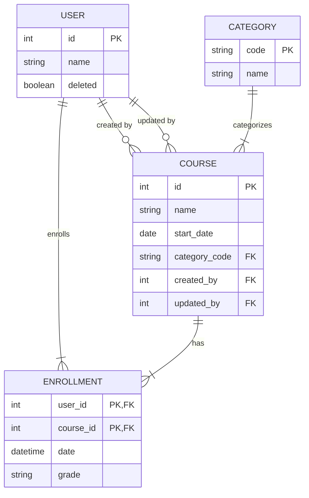

# Spring Boot API Demo

## Overview

This project serves as both a **reusable commons package** and a **demonstration implementation** for building modern Spring Boot REST APIs. It provides a comprehensive set of utilities, patterns, and best practices that can be extracted into a shared library and extended for use in production applications.

The demo implementation showcases a course enrollment system with users, courses, categories, and enrollments, demonstrating various Spring Boot capabilities including JPA auditing, GraphQL, JSON Merge-Patch operations, soft deletes, and more.

### Key Features

- **Reusable Components**: Generic utilities, base classes, and configuration patterns designed for extraction into a commons library
- **Production-Ready Patterns**: Optimistic locking, soft deletes, audit trails, and comprehensive validation
- **Modern API Standards**: REST with JSON Merge-Patch (RFC 7396), GraphQL, and OpenAPI specifications
- **Extensible Architecture**: Designed with modularity and extensibility in mind for easy adaptation to different domains

## TODO

- [ ] Single & group / complex validation
- [ ] Role-based patch extent
- [ ] 1 x query DTO + 1 x custom DTO
- [ ] Page metadata in response vs headers
- [ ] Import
  - [ ] Modulith
  - [ ] JwtUtils
  - [ ] AuditorAware
  - [ ] EncryptedDataSourceConfig
  - [ ] ApplicationEvent
  - [ ] ExcelExportable
- [ ] entityManager in mapper -> common

- @ManyToOne(fetch =  FetchType.LAZY)
- 

## Aspects

- Spring Modulith for code separation

- [ ] Data
  - [x] Enumerations ([`EnrollmentGrade`](src/main/java/com/example/demo/entity/EnrollmentGrade.java))
  - [x] Generic entity PKs: auto-incremented Long ID (`Course` & `User`), String ID (`Category`), composite (`Enrollment`)
  - [x] Optimistic locking (@Version column)
  - [x] Soft delete of specific entities (`User`)
  - [x] Audit (Hibernate Envers)
  - [ ] Custom repository implementation (using `EntityManager`)
  - [ ] UUID external references
  - [ ] Liquibase schema versioning
  - [ ] Audit
    - [x] Hibernate Envers
      - [ ] AuditReader
      - [ ] RevisionRepository
- [ ] API
  - [x] Json Merge PATCH operation for specific resources (i.e. RFC 7396)
  - [ ] Generic resource filtering, sorting & pagination
  - [ ] Problem Details (i.e. RFC 9457)
  - [x] GraphQL implementation based on existing service layer
  - [ ] API-first approach
    - [ ] Page
    - [ ] Pageable
  - [ ] 
- [ ] Security
  - [ ] Role-based authorization
  - [x] JWT-based `SecurityUtils`
  - [ ] Service layer method security (i.e. `@EnableMethodSecurity`)
  - [ ] Proxy users
  - [ ] @CreatedBy
- Testing
  - [ ] Integration tests
  - [ ] Unit tests
  - [ ] **Testcontainers** (H2 vs native DB)
  - [ ] Global error handler

## ERD

## References

### JSON Merge-Patch
- https://medium.com/@AlexanderObregon/working-with-json-patch-vs-merge-patch-for-partial-updates-in-spring-boot-apis-57377bfe4e5a
- https://medium.com/@ljcanales/handling-partial-updates-in-spring-boot-a-cleaner-approach-to-patch-requests-6b13ae2a45e0
- https://gaetanopiazzolla.github.io/java/jsonpatch/springboot/2024/09/25/boot-patch.html
- https://www.baeldung.com/javax-validation-method-constraints#bd-3-creating-cross-parameter-constraints

### OpenAPI Spring Generator

- https://github.com/OpenAPITools/openapi-generator/tree/master/modules/openapi-generator-gradle-plugin
- https://github.com/OpenAPITools/openapi-generator/blob/master/docs/generators/spring.md
- https://medium.com/@jugurtha.aitoufella/custom-validation-with-openapigenerator-and-spring-boot-3-34a656e815c8